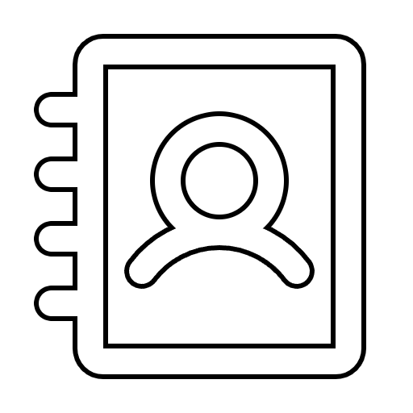
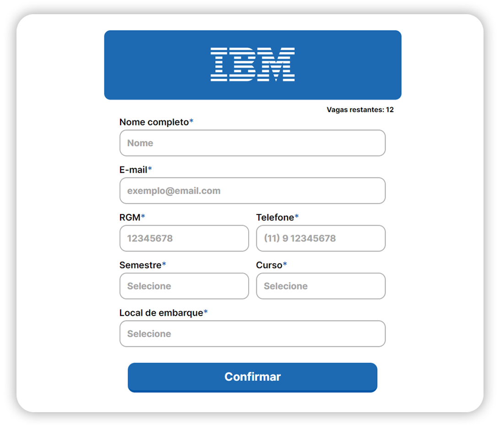

<div id="top"></div>

<!-- PROJECT LOGO -->
<br />
<div align="center">
    
  </a>

<h3 align="center">Tech Visit Form</h3>

  <p align="center">
    A form to get info about the student who wants to go to a Tech visit.

</div>

<!-- ABOUT THE PROJECT -->


<hr>

### Built With


### *Front-end*
* [Vite](https://vitejs.dev/)
* [ReactJS](https://pt-br.reactjs.org/)
* [Phosphor-react](https://phosphoricons.com/)

### *Back-end*
* [NodeJS](https://nodejs.org/en/)
* [Express](https://www.npmjs.com/package/express)
* [Prisma](https://www.prisma.io/)

<!-- GETTING STARTED -->
## Getting Started

**1- Clone this repository:**
```bash
git clone https://github.com/luizfranzon/techVisitScheduler
```
**2- Install the dependencies:**
```bash
npm install
```
**3- Run the application:**
```bash
npm run dev
```
<!-- ROADMAP -->

<hr>

<p align="right"><a href="#top">Click to go back to top</a></p>
